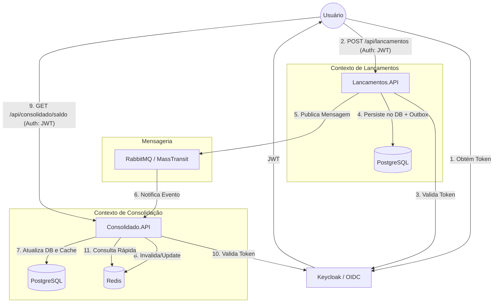

# Ecossistema Financeiro: Gestão de Lançamentos e Saldos

Este projeto implementa uma arquitetura de microsserviços voltada para alta disponibilidade e consistência eventual. O foco principal é demonstrar padrões modernos de desenvolvimento para sistemas financeiros, como **Transactional Outbox**, **Event-Driven Architecture** e **Cache-Aside**.

---

## 🏗 Arquitetura do Sistema (C4 Model)

O diagrama abaixo descreve o fluxo de dados desde a entrada do lançamento até a consolidação do saldo, destacando o papel estratégico do RabbitMQ e do Redis.



---

## 🛠 Tecnologias e Padrões

O ecossistema foi construído utilizando as seguintes tecnologias:

- **Back-end**: .NET 10.0 (C#) com Clean Architecture.
- **Mensageria**: RabbitMQ com MassTransit (garantia de entrega e retentativas).
- **Armazenamento**: PostgreSQL (Dados transacionais) e Redis (Performance de leitura).
- **Segurança**: Keycloak para gerenciamento de identidade e autenticação JWT.
- **Observabilidade**: OpenTelemetry integrado ao Jaeger (Traces) e Prometheus (Métricas).

---

## 🚀 Guia de Execução

Para subir o ambiente completo (infraestrutura e aplicações), utilize o Docker:

```bash
docker compose up -d --build
```

### Endpoints de Referência:
- **API Lançamentos**: [http://localhost:5000/scalar/v1](http://localhost:5000/scalar/v1)
- **API Consolidado**: [http://localhost:5001/scalar/v1](http://localhost:5001/scalar/v1)
- **Painel Jaeger**: [http://localhost:16686](http://localhost:16686)
- **Painel Keycloak**: [http://localhost:8081](http://localhost:8081) (Credenciais: `admin`/`admin`)

---

## 🔐 Procedimento de Teste

Siga os passos abaixo para validar o fluxo entre os serviços:

### 1. Obtenção de Token
Acesse a **Lancamentos.API** e utilize o endpoint `POST /api/Auth/token` com as credenciais:
- **User**: `admin` | **Pass**: `admin`
- Copie o `access_token` retornado.

### 2. Autenticação
No Scalar (Swagger), clique no botão **Authorize** e insira o token obtido. Repita este processo para a **Consolidado.API**.

### 3. Registro de Lançamento
Envie um novo lançamento via `POST /api/Lancamentos`:
```json
{
  "valor": 1250.50,
  "tipo": "credito"
}
```

### 4. Validação de Saldo
Acesse a **Consolidado.API** e execute o `GET /api/Consolidado/saldo`. O valor acumulado refletirá o lançamento processado de forma assíncrona.

---

## 🧪 Resiliência e Falhas (Simulação)

Para validar o funcionamento do **Transactional Outbox**:
1. Interrompa o serviço de mensageria: `docker compose stop rabbitmq`.
2. Realize lançamentos via API. Note que a API responderá com sucesso, salvando os dados localmente.
3. Reinicie o serviço: `docker compose start rabbitmq`.
4. Observe no Jaeger (ou via consulta de saldo) que as mensagens "presas" no banco de dados foram processadas e o saldo foi sincronizado automaticamente.

---

## 📊 Qualidade de Código
O projeto está configurado para análise contínua no SonarQube. Para disparar um scan manual:
```powershell
.\run-scan.ps1
```
Acompanhe os resultados em: [http://localhost:9000](http://localhost:9000).
