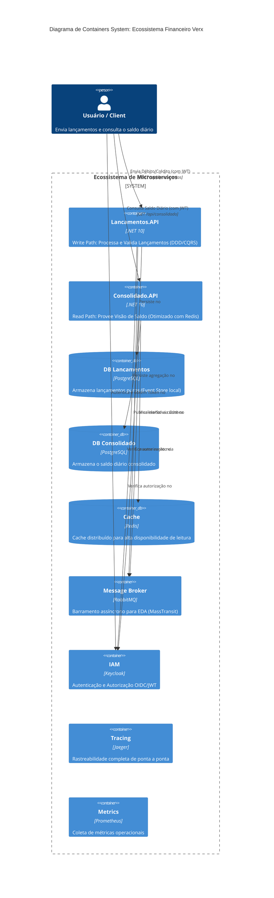

# Lancamentos e Consolidado API (Production Ready Ecosystem)

Este projeto demonstra uma arquitetura de microsserviços de nível empresarial, atendendo a rigorosos requisitos não-funcionais de **Segurança**, **Escalabilidade**, **Resiliência** e **Observabilidade**.

## 🏗️ Arquitetura e Design Patterns

O sistema utiliza os seguintes padrões arquiteturais para garantir flexibilidade e robustez:

- **Microservices Architecture**: Serviços independentes com bancos de dados isolados.
- **N-Layer Architecture**: Separação clara entre Domínio, Aplicação e Infraestrutura.
- **Event-Driven Architecture (EDA)**: Comunicação assíncrona via RabbitMQ e MassTransit.
- **Transactional Outbox Pattern**: Garante a consistência eventual e a entrega de mensagens.
- **Materialized View**: Otimização de leitura para o saldo consolidado.

## 🎯 Atendimento aos Requisitos do Desafio (Arquiteto de Software)

Esta arquitetura foi desenhada propositalmente para cumprir os requisitos funcionais e não-funcionais mais complexos especificados para a vaga:

### 1. Resiliência e Desacoplamento (Obrigatório: Lançamento não deve cair)

Implementamos uma **Arquitetura Orientada a Eventos (EDA)** baseada no **RabbitMQ** unida ao poderoso **Transactional Outbox Pattern**. Se a API de Consolidado ou até mesmo o RabbitMQ caírem, a API de Lançamentos **NÃO** fica indisponível. Ela persiste o lançamento no PostgreSQL junto com a mensagem intencionada na mesma transação técnica. Quando a infraestrutura retorna, o MassTransit esvazia o Outbox, aplicando o conceito de *Self-Healing* e *Consistência Eventual*.

### 2. Escalabilidade Extrema (Obrigatório: 50 req/seg no Consolidado)

Para atingir e exceder a meta com **0% de perda de requisições**, os serviços foram construídos de forma estritamente dependente de estado livre (*Stateless*). A API de Consolidado atua como um sistema otimizado para leitura de alta vazão suportado pelo **Redis (Cache Distribuído)**. O acesso ao banco relacional acontece na retaguarda, deixando a resposta em memória com tempo de resposta na casa de sub-milissegundos.

### 3. Segurança Sólida

A autenticação e abstração de autorização não estão "chumbadas" no código, mas delegadas a um IAM de classe mundial, o **Keycloak**. Utilizamos **OpenID Connect (OIDC)** emitindo e validando *Bearer Tokens (JWT)* com tempo de expiração definidos, garantindo o transporte seguro de dados criptografados pelas claims entre os componentes.

### 4. Padrões de Arquitetura e Integração

Adotou-se o padrão **Microsserviços** devido aos domínios com cargas operacionais dispares (Carga de gravação pesada vs Carga de leitura massiva), adotando os conceitos de **CQRS**. A comunicação assíncrona baseia-se no protocolo leve AMQP gerenciado pelo framework **MassTransit**, abstraindo a complexidade de conexão e controle da fila da camada de aplicação e mantendo os domínios 100% agnósticos ao broker.

### 5. Requisitos Não Funcionais (Observabilidade)

Desenvolver grandes sistemas exige que eles não voem às cegas. O ecossistema está instrumentado com **OpenTelemetry** exportando logs e métricas nativas (.NET 10). Contamos com o **Jaeger** para rastreamento distribuído inter-operações e **Prometheus** injetando total monitorabilidade operacional. Implementamos também **Health Checks** prontos para plataformas PaaS/CaaS efetuarem balanceamento proativo.

## 🗺️ Diagrama de Containers (C4 Model)



## 🔐 1. Segurança (Identity & Access Management)

Implementamos o **Keycloak** como provedor de identidade (OIDC/OAuth2):

- **Autenticação JWT**: Todos os endpoints das APIs (`/api/lancamentos` e `/api/consolidado`) são protegidos.
- **Centralização**: Gerenciamento de usuários e clients centralizado no Realm `Verx`.
- **RBAC (Role Based Access Control)**: Estrutura pronta para permissões granulares.

## 🚀 2. Escalabilidade e Desempenho

Para suportar altas cargas de trabalho sem degradação:

- **Cache Distribuído com Redis**: O serviço de Consolidação utiliza Redis para cachear saldos diários, reduzindo drasticamente o tempo de resposta e a carga no PostgreSQL.
- **Stateless Services**: Las APIs podem ser escaladas horizontalmente sem perda de estado.
- **Load Balancing**: Pronto para ser balanceado em ambientes como Kubernetes.

## 🛡️ 3. Resiliência e Monitoramento Proativo

Projetado para se recuperar automaticamente de falhas:

- **Health Checks**: Monitoramento em tempo real do estado das APIs, Bancos e Mensageria através do endpoint `/health`.
- **Retry Policies**: Consumidores de mensagens possuem políticas de retentativa em caso de falhas transientes.
- **Self-Healing**: Scripts de inicialização garantem que as APIs aguardem a disponibilidade dos bancos antes de iniciar.

## 📊 4. Observabilidade (Distributed Tracing)

Implementamos o stack de observabilidade moderno com **OpenTelemetry**:

- **Tracing**: Rastreamento completo de requisições via **Jaeger**, permitindo visualizar o caminho de uma mensagem desde o lançamento até a consolidação.
- **Metrics**: Coleta de métricas de performance via **Prometheus**.

## 📁 Organização Modular

```text
src/
├── Lancamentos/                # Módulo de Escrita (PostgreSQL + Outbox)
├── Consolidado/                # Módulo de Leitura (PostgreSQL + Redis Cache)
└── Shared.Contracts/           # Contratos de Integração
```

## 🚀 Como Executar o Ecossistema Completo

1. **Subir tudo**:

   ```bash
   docker compose up -d --build
   ```

2. **Acessar ferramentas**:
   - **Jaeger (Tracing)**: `http://localhost:16686`
   - **Prometheus (Métricas)**: `http://localhost:9090`
   - **Keycloak (Security)**: `http://localhost:8081` (admin/admin)
   - **Health Checks**: `http://localhost:5000/health` (Lancamentos)

3. **Documentação API (Scalar)**:
   - **Lancamentos**: `http://localhost:5000/scalar/v1`
   - **Consolidado**: `http://localhost:5001/scalar/v1`

## 🔐 Como realizar a Autenticação e Testes

Para validar o fluxo completo de ponta a ponta, siga estes passos:

1. **Obter Token de Acesso**:
   - Acesse o **Scalar** da Lancamentos.API: `http://localhost:5000/scalar/v1`.
   - Localize o endpoint `POST /api/Auth/token`.
   - Clique em **Test Request** e informe nos Query Parameters:
     - `username`: `admin`
     - `password`: `admin`
   - Copie **apenas o valor da string** do campo `access_token` no JSON de resposta.

2. **Autorizar no Scalar**:
   - No topo da página do Scalar, clique no botão **Authorize**.
   - No campo **Bearer Token**, cole o token que você copiou.

3. **Criar Lançamentos (Escrita)**:
   - Use o endpoint `POST /api/Lancamentos`.
   - **Exemplo de Crédito**:

     ```json
     {
       "valor": 1000.00,
       "tipo": "credito"
     }
     ```

   - **Exemplo de Débito**:

     ```json
     {
       "valor": 350.50,
       "tipo": "debito"
     }
     ```

4. **Consultar Saldo Diário (Leitura)**:
   - Acesse o **Scalar** da Consolidado.API: `http://localhost:5001/scalar/v1`.
   - Lembre-se de clicar em **Authorize** e colar o mesmo token lá.
   - Execute o `GET /api/Consolidado/saldo`. O valor deve refletir as operações feitas no passo anterior.

## 📊 Testando a Observabilidade e Resiliência

O projeto possui instrumentação completa com **OpenTelemetry** e **MassTransit**.

1. **Rastreamento de Ponta a Ponta (Jaeger)**:
   - Acesse `http://localhost:16686`.
   - Selecione o serviço `Lancamentos.API` e clique em **Find Traces**.
   - Você verá um fluxo completo mostrando:
     - O recebimento da requisição HTTP.
     - A persistência no Postgres.
     - A publicação da mensagem via MassTransit.
     - O consumo da mensagem pela **Consolidado.API** e a atualização do saldo.

2. **Teste de Resiliência**:
   - Desligue o RabbitMQ: `docker compose stop rabbitmq`.
   - Faça um novo lançamento. Ele será salvo no Banco de Dados (Outbox), mas não será processado pelo Consolidado.
   - Ligue o RabbitMQ: `docker compose start rabbitmq`.
   - Observe no Jaeger e nos Logs que as mensagens foram enviadas retroativamente e o saldo agora está correto.

3. **Análise Estática de Segurança (SAST) com SonarQube**:
   - O projeto já vem preparado para inspeção de código, qualidade (Clean Code) e segurança (Vulnerabilidades).
   - Para rodar a análise, o primeiro passo é iniciar o container local:

     ```bash
     docker compose up -d sonarqube
     ```

   - Aguarde o serviço iniciar na porta `9000`. Depois, na raiz do projeto (via PowerShell), execute a esteira de análise que varrerá as duas APIs:

     ```powershell
     powershell -ExecutionPolicy Bypass -File .\run-scan.ps1
     ```

   - Após a barra de progresso ser concluída, acesse o painel pelo navegador em `http://localhost:9000` para consultar os indicadores globais da solução.

## 🔮 Evoluções Futuras Desejáveis (Roadmap)

Embora esta PoC entregue a robustez requerida, um planejamento arquitetural sempre busca amadurecimento contínuo. Em um escopo expandido ou com mais tempo, as seguintes melhorias seriam fundamentais:

1. **Idempotência Garantida**: Implementar chaves de idempotência robustas para evitar lançamentos duplicados gerados tanto pelo usuário (double-click) quanto pela eventual repetição transiente (retries) do message-broker.
2. **Orquestração Moderna**: Migrar a malha do Docker Compose para um ecossistema gerenciado com **Kubernetes** ou Serverless. Utilizar o **KEDA (Kubernetes Event-driven Autoscaling)** para escalar horizontalmente a API de Consolidado com base exata na pressão da fila Rabbit.
3. **Dashboards Gerenciais**: Subir nativamente um worker com o **Grafana** amarrado ao Prometheus, transformando os logs técnicos atuais do OpenTelemetry em painéis amigáveis aos stakeholders (negócios).
4. **Proteção Contra Sobrecarga**: Incluir nativamente uma arquitetura baseada em API Gateway contendo regras customizadas de **Rate Limiting** para proteger especificamente as rotas sob o escopo público e blindá-las de ataques DDoS mitigando o abuso de processamento backend.
5. **Automação CI/CD Completa**: Incluir *Pipelines* declarativos contendo stages de SAST (SonarQube) e builds imutáveis no GitHub Actions para reforço imediato de integridade na ramificação Main.

---

